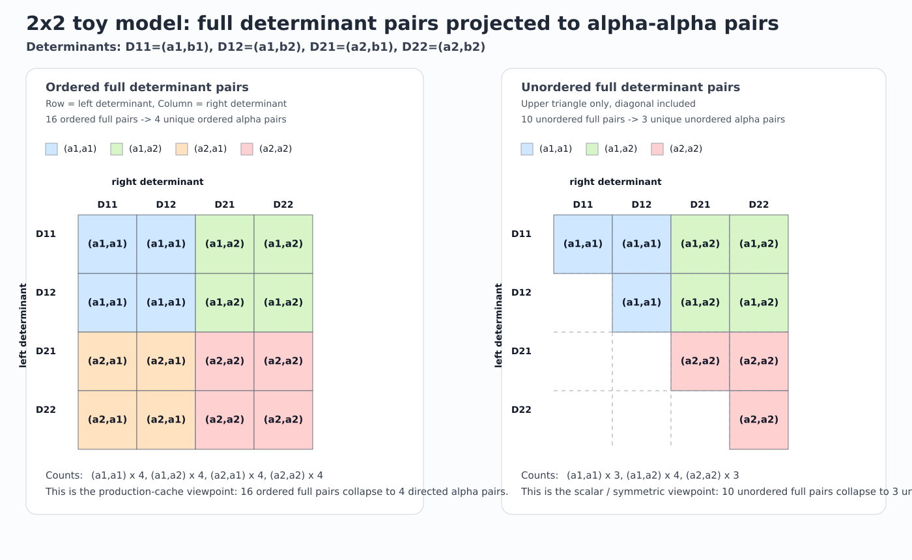

# 2x2 alpha-alpha pair mapping

This figure shows the same 2x2 toy model from two counting viewpoints:

- ordered full determinant pairs: `16 -> 4`
- unordered full determinant pairs: `10 -> 3`

Determinants:

- `D11 = (a1,b1)`
- `D12 = (a1,b2)`
- `D21 = (a2,b1)`
- `D22 = (a2,b2)`

Image:

How to read it:

- left panel:
  production-cache viewpoint, where directional same-spin payloads are distinct
  and we keep `(a1,a2)` and `(a2,a1)` separately.
- right panel:
  scalar/symmetric viewpoint, where only the unordered upper triangle matters
  and `(a1,a2)` is the same pair as `(a2,a1)`.
